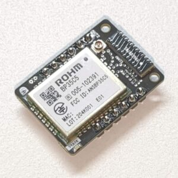

# WFAN920 Library for Spresense with WFAN920(Wi-SUN add-on board).

This library provides support for the WFAN920 (Wi-SUN FAN module add-on) with Spresense.

[WFAN920 Product Page](https://crane-elec.co.jp/products/vol-33/)

## Installation

Arduino IDEのライブラリマネージャから「WFAN920」と検索してインストールできます。  
または、ZIPファイルをダウンロードしてArduino IDEでインストールすることも可能です。

詳しい手順は[Arduinoライブラリのインストール方法](https://docs.arduino.cc/software/ide-v1/tutorials/installing-libraries/)を参照してください。

You can install this library by searching for "WFAN920" in the Arduino IDE Library Manager.  
Alternatively, you can download the ZIP file and install it via the Arduino IDE.

For detailed instructions, please refer to [How to Install Arduino Libraries](https://docs.arduino.cc/software/ide-v1/tutorials/installing-libraries/).

## Usage

Run the example sketch located in the `examples/BasicUsage` directory.

## Note

WFAN920はローム株式会社 BP35C5を使用しています。  
[ローム株式会社 BP35C5](https://www.rohm.co.jp/products/wireless-communication/specified-low-power-radio-modules/bp35c5-product)  
モジュールの詳細なコマンドリファレンスは、株式会社日新システムズが提供する資料をユーザー登録の上、参照する必要があります。  
[株式会社日新システムズサポートページ](https://e-support.co-nss.co.jp/wisunfan.html)  

WFAN920 uses the ROHM BP35C5 module.  
[ROHM BP35C5 Product Page](https://www.rohm.co.jp/products/wireless-communication/specified-low-power-radio-modules/bp35c5-product)
To access the detailed command reference for the module, you need to register as a user and refer to the documentation provided by Nissin Systems Co.,Ltd.  
[Nissin Systems Support Page](https://e-support.co-nss.co.jp/wisunfan.html)

### Caution

WFAN920は、株式会社日新システムズとは無関係です。そのため、本モジュールのハードウェア・操作・コマンド詳細等すべてにおいて、株式会社日新システムズ様へ絶対に問合せないしないでください。  
WFAN920 is not affiliated with Nissin Systems Co., Ltd. Therefore, please do not contact Nissin Systems regarding any hardware, operation, or command details of this module.

